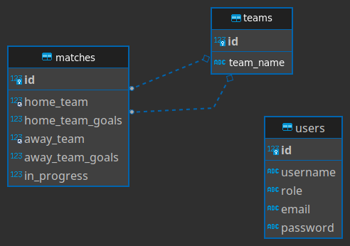

# Trybe Futebol Clube

## Contexto

**Eu desenvolvi os arquivos contigos em `/app/backend/src`.
Todos arquivos exeto os citados acima foram desenvolvidos pela [Trybe](https://www.betrybe.com/).**

O TFC é um site informativo sobre partidas e classificações de futebol! :soccer:.

No time de desenvolvimento do TFC, Meu squad ficou responsável por desenvolver uma API (utilizando o método TDD) e também integrar - através do docker-compose - as aplicações para que elas funcionem consumindo um banco de dados.

Nesse projeto, eu construi um back-end dockerizado utilizando modelagem de dados através do Sequelize. Desenvolvimento respeita regras de negócio providas no projeto e a API deve ser capaz de ser consumida por um `**front-end** já provido nesse projeto.`

Desafios:

- Para adicionar uma partida é necessário ter um token, portanto a pessoa deverá estar logada para fazer as alterações. Teremos um relacionamento entre as tabelas teams e matches para fazer as atualizações das partidas.

- O seu back-end deverá implementar regras de negócio para popular adequadamente a tabela disponível no front-end que será exibida para a pessoa usuária do sistema.

## Técnologias usadas

Front-end:
> Desenvolvido usando: React, CSS3, HTML5, Javascript, ES6, React-Router, Context API, Docker

Back-end:
> Desenvolvido usando: Typescript, Node.js, Express.js, Docker, JWT, mocha, chai, sinon, Sequelize ORM.

## Habilidades

Adquiri essas habilidades ao desenvolver esse projeto:

- A realização da dockerização dos apps, network, volume e compose;

- A modelagem de dados com MySQL através do Sequelize;

- A criação e associação de tabelas usando models do sequelize;

- A construção de uma API REST com endpoints para consumir os models criados;

- A construção de um CRUD com TypeScript, utilizando ORM;

## Preview da Aplicação

| . | Diagrama de ER|
| :---: | :---: |
|  |  |

## Instalando Dependências

- clone o projeto:

  ```bash
  git clone git@github.com:El1v/futebol-clube-api.git
  ```

  > Docker

    ```bash
    cd futebol-clube-api
    npm run compose:up
    ```

    ```bash
    #Produção
    npm run compose:up
    ```

    ```bash
    # Dev mode
    npm run compose:up:dev
    ```

  > Backend

  ```bash
  cd backend/ 
  npm install
  ```

  > Frontend

  ```bash
  cd frontend/
  npm install
  ```

## Executando aplicação

:warning: Configurações mínimas para execução do projeto

Na sua máquina você deve ter:

- Sistema Operacional Distribuição Unix;

- Node versão 16;

- Docker;

- Docker-compose versão >=1.29.2;

:arrow_right: O node deve ter versão igual ou superior à 16.14.0 LTS:

Para instalar o nvm, acesse esse link;
Rode os comandos abaixo para instalar a versão correta de node e usá-la:
nvm install 16.14 --lts
nvm use 16.14
nvm alias default 16.14

:arrow_right: Odocker-compose deve ter versão igual ou superior à ˆ1.29.2:

Use esse [link de referência para realizar a instalação corretamente no ubuntu](https://docs.docker.com/compose/);
Acesse o [link da documentação oficial com passos para desinstalar](https://docs.docker.com/compose/install/#uninstallation) caso necessário.

:gear: Variáveis de ambiente

No diretório app/backend/ renomeie o arquivo .env.example para .env e configure os valores de acordo com o cenário do seu ambiente (credenciais de banco de dados, secrets desejadas e etc).

:warning: Variáveis de ambiente além das especificadas acima não são suportadas, pois não são esperadas pelo avaliador do projeto. :warning:

:warning: Não defina variável de ambiente para o nome do banco, o mesmo deve se manter com o nome TRYBE_FUTEBOL_CLUBE. :warning:

- Para rodar o banco de dados:

  ```bash
  cd app/backend
  npm run build
  ```

- Para rodar o back-end:

  ```bash
  cd app/backend/ && npm start
  ```

- Para rodar o front-end:

  ```bash
  cd app/frontend/ && npm start
  ```

## Executando Testes

- Para rodar todos os testes:

  ```bash
  npm run test:coverage
  ```
